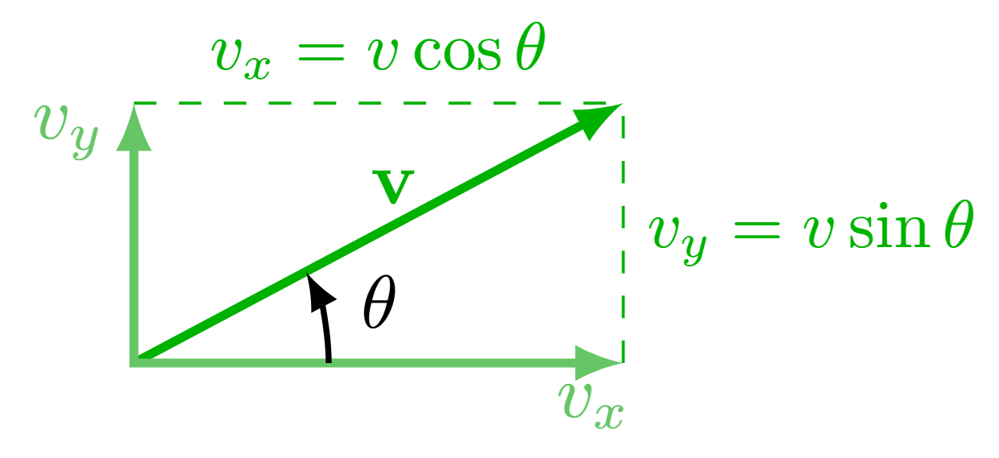

Kinematics is the study of motion without considering the forces that cause it. It focuses on describing motion using quantities like displacement, velocity, and acceleration.
#### 1.1 Scalars and Vectors
- <u>Scalar</u>: A quantity with magnitude only (e.g., speed, distance, mass, volume, temperature, energy).
- <u>Vector</u>: A quantity with both magnitude and direction (e.g., velocity $\vec{v}$, displacement $\Delta \vec{x}$, acceleration  $\vec{a}$).
- <u>Component Vectors</u>: If a vector is at an angle use trigonometric functions to get the x and y components. Remember to use the correct angle and appropriate Trig function.
#### 1.2 Distance, and Speed
- <u>Distance</u>: Distance is how far something moves and it includes the path travelled.
- <u>Speed</u>: $\frac{distance}{time}$
#### 1.3 Displacement, Velocity, and Acceleration
| **Quantity**                                                                                                                          |  **Equation**                                            |
| ------------------------------------------------------------------------------------------------------------------------------------- | -------------------------------------------------------- |
| <u>Displacement</u>: The straight-line distance from where the object started to where it ended. The change in position of an object. | $\Delta \vec{x} = \vec{x}_f - \vec{x}_i$                 |
| <u>Average Velocity</u>: The rate of change of displacement over a time interval.                                                     | $\vec{v}_{\text{avg}} = \frac{\Delta \vec{x}}{\Delta t}$ |
| <u>Instantaneous Velocity</u>: The velocity of an object at a specific moment in time.                                                | $\vec{v} = \frac{d\vec{x}}{dt}$                          |
| <u>Average Acceleration</u>: The rate of change of velocity over a time interval.                                                     | $\vec{a}_{\text{avg}} = \frac{\Delta \vec{v}}{\Delta t}$ |
| <u>Instantaneous Acceleration</u>: The acceleration of an object at a specific moment in time.                                        | $\vec{a} = \frac{d\vec{v}}{dt}$                          |
#### 1.4 Equations of Motion (UAM - Uniformly Accelerated Motion)
These equations apply when acceleration is constant.

| **Description**                                                             | **Equation**                           |
| --------------------------------------------------------------------------- | -------------------------------------- |
| Relates final velocity to initial velocity, acceleration, and time.         | $v_f = v_i + at$                       |
| Relates displacement to initial velocity, acceleration, and time.           | $\Delta x = v_i t + \frac{1}{2} a t^2$ |
| Relates final velocity to initial velocity, acceleration, and displacement. | $v_f^2 = v_i^2 + 2a \Delta x$          |
| Relates displacement to average velocity and time.                          | $\Delta x = \frac{1}{2} (v_i + v_f) t$ |
#### 1.5 Graphical Analysis of Motion
| **Graph**             | **Slope Represents** | **Area Represents** | **Key Observations**                                                 |
| --------------------- | -------------------- | ------------------- | -------------------------------------------------------------------- |
| Position vs. Time     | Velocity             | -                   | Steeper slope = higher velocity, Zero slope = object at rest.        |
| Velocity vs. Time     | Acceleration         | Displacement        | Steeper slope = higher acceleration, Zero slope = constant velocity. |
| Acceleration vs. Time | -                    | Change in velocity  | Area under the curve = $\Delta v$.                                   |
#### 1.6 Free Fall
- Acceleration due to gravity ($g$): $g = 9.81 \, \text{m/s}^2$ (downward direction is negative).
- In free fall, the only force acting on the object is gravity (ignoring air resistance).
- Equations of motion apply with $a = -g$.
#### 1.7 Projectile Motion
Projectile motion is the motion of an object launched into the air, subject only to gravity.
##### Key Points:
- The horizontal and vertical motions are independent.
- Horizontal motion: Constant velocity ($a_x = 0$).
- Vertical motion: Constant acceleration ($a_y = -g$).
##### Equations:
| **Quantity**            | **Equation**                                               |
| ----------------------- | ---------------------------------------------------------- |
| Horizontal displacement | $\Delta x = v_{x0} t$                                      |
| Vertical displacement   | $\Delta y = v_{y0} t - \frac{1}{2} g t^2$                  |
| Time of flight          | $t = \frac{2 v_{y0}}{g}$ (for symmetric projectile motion) |
#### 1.8 Relative Motion
- The motion of an object as observed from a different frame of reference
- Relative velocity: $\vec{v}_{\text{A relative to B}} = \vec{v}_{\text{A}} - \vec{v}_{\text{B}}$
#### Problem-solving tips
- Be careful to not add vectors that represent different types of quantities. This seems obvious when talking about scalar quantities like temperature and volume. For example, you can't add \[25\degree\text{C}\] to \[2\,\text{L}.\] Similarly, you can't add a displacement vector of \[25\,\text{m}\] to a velocity vector of \[-2\,\text{m/s}.\] The result would be meaningless. As always in science, paying careful attention to units can help avoid mistakes.
    - Remember to clearly define your coordinate system before doing any calculations with vectors. It's easy to forget that you're working with vectors, especially since positive vector values "look like" scalars with no sign. But direction and sign are very important with vectors, even if the direction is an implied "\[+\]."
- - **Confusion about choosing the “correct” coordinate system.** All coordinate systems are equally valid, so we can choose any system. The choice will affect the numbers in the calculation, but as long as we use the coordinate system consistently, the physical meaning of the answer won't change.